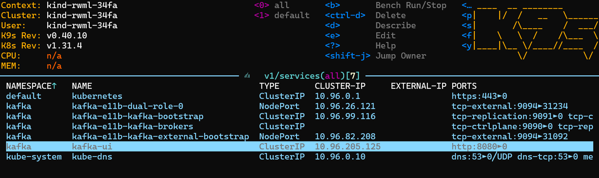

# MLOps Crypto Predictor


A comprehensive MLOps project for real-time cryptocurrency price prediction using Kafka, Kind, Kubernetes, uv, and Quix Streams. The project is structured with separate development and production environments, with the production cluster deployed on Civo Cloud.

## Project Structure

```text
mlops-llm-crypto-predictor/
├── dashboards/                     # Grafana dashboards
├── deployments/                    # Kubernetes manifests
│   ├── dev/                        # Development environment configurations
│   │   ├── candles/                # Candles service K8s manifests
│   │   ├── kind/                   # Kind cluster configuration
│   │   │   ├── manifests/          # Kafka, MLflow, etc. manifests
│   │   │   └── scripts/            # Cluster setup scripts
│   │   ├── prediction-generator/   # Prediction service K8s manifests
│   │   ├── technical-indicators/   # Technical indicators K8s manifests
│   │   └── trades/                 # Trades service K8s manifests
│   └── prod/                       # Production environment configurations
│       ├── candles/                # Candles service K8s manifests
│       ├── prediction-generator/   # Prediction service K8s manifests
│       ├── technical-indicators/   # Technical indicators K8s manifests
│       └── trades/                 # Trades service K8s manifests
├── docker/                         # Docker-related files and documentation
├── images/                         # Documentation images
├── services/                       # Microservices
│   ├── candles/                    # Candles aggregation service
│   ├── predictor/                  # ML prediction service
│   ├── technical_indicators/       # Technical analysis service
│   └── trades/                     # Trades data ingestion service
├── .dockerignore                   # Docker ignore file
├── .gitignore                      # Git ignore file
├── .pre-commit-config.yaml         # Pre-commit configuration
├── LICENSE                         # Project license
├── Makefile                        # Project automation commands
├── pyproject.toml                  # Project dependencies and configuration
└── README.md                       # Project documentation
```

## Getting Started

### Initialize the Project

Initialize the project from the root directory to create the main `pyproject.toml` file:

```bash
uv init
```

Create a `trades` workspace in the `services` directory:

```bash
cd services
uv init --lib trades
```

This creates a `pyproject.toml` file in the `trades` workspace with the `src` layout, includes the `hatchling` build-system, and adds the `trades` workspace to the main `pyproject.toml` file.

### Managing Workspaces

Each service is treated as a separate workspace using the `[tool.uv.workspace]` section to define all workspace members.

To declare a workspace member in the main `pyproject.toml`:

```toml
[tool.uv.workspace]
members = ["services/trades"]
```

To add a workspace as a dependency:

```bash
uv add trades
```

This command:

1. Adds trades to the dependencies list
1. Adds an entry to the `[tool.uv.sources]` section in `pyproject.toml`, marking it as a workspace dependency:

```toml
[tool.uv.sources]
trades = { workspace = true }
```

### Adding Dependencies

Add dependencies to the main project:

```bash
uv add quixstreams
```

Add development dependencies using dependency groups:

```bash
uv add --group tests pytest
```

### TA-Lib Installation

TA-Lib is required for technical analysis of financial data. Install it before adding it to the project:

1. Follow the installation instructions at [ta-lib.org](https://ta-lib.org/install/#executable-installer-recommended)
1. Add the package to the project:

```bash
uv add ta-lib
```

### Synchronize the Project

Synchronize the project without installing dependency groups:

```bash
uv sync
```

Synchronize the project and install all dependency groups:

```bash
uv sync --all-groups
```

## Infrastructure Setup

### Setting up Kafka

Create a Kind cluster with port mapping for Kafka:

```bash
chmod +x deployments/dev/kind/create_cluster.sh
./deployments/dev/kind/create_cluster.sh
```

The `deployments/dev/kind` directory contains:

- `kind-with-portmapping.yaml`: Kind configuration with port mapping for Kafka
- `manifests/`: Kafka configuration files
  - `kafka-e11b.yaml`: Creates 2 Kafka pods (`dual-role` and `entity-operator`)
  - `kafka-ui-all-in-one.yaml`: Creates the Kafka UI pod
- `install_kafka.sh`: Installs Kafka using [Strimzi](https://strimzi.io/quickstarts/)
- `install_kafka_ui.sh`: Installs Kafka UI
- `create_cluster.sh`: Runs all scripts to create the Kind cluster with Kafka and Kafka UI

After running the script, you should see the cluster in the `k9s` terminal:


Check services and port mapping for Kafka and Kafka UI:



### Accessing Kafka UI

Forward the Kafka UI port to access it from your local machine:

```bash
kubectl -n kafka port-forward svc/kafka-ui 8182:8080
```

For background port forwarding using tmux:

```bash
tmux new-session -d 'kubectl -n kafka port-forward svc/kafka-ui 8182:8080'
```

Access the Kafka UI at [http://localhost:8182](http://localhost:8182).


Test the Kafka broker connection:

```bash
nc -vvv localhost 31234
```

### Running Services

#### Trades Service

The trades service connects to the Kraken API to get real-time trade data and produces it to the Kafka topic `trades`:

```bash
uv run services/trades/src/trades/main.py
```

You should see trade data in both the terminal and Kafka UI:


#### Managing Partitions

By default, the number of partitions is 1. If you change it to 2, trade data will be distributed between both partitions. Only deploy the candles service with 2 replicas when both partitions have values.

Note: Changing partitions after deploying the candles service will cause errors. You'll need to delete and redeploy the candles service with the new partition count.

### Setting up RisingWave

RisingWave is a streaming database for real-time analytics. Install it using:

```bash
chmod +x deployments/dev/kind/install_risingwave.sh
./deployments/dev/kind/install_risingwave.sh
```

Access the RisingWave database:

```bash
kubectl port-forward svc/risingwave -n risingwave 4567:4567
psql -h localhost -p 4567 -d dev -U root
```

#### Connecting RisingWave to Kafka

Create a table in RisingWave to connect to Kafka. Example from `query.sql`:

```sql
CREATE SOURCE my_kafka_source (
    user_id INT,
    product_id VARCHAR,
    timestamp TIMESTAMP
) WITH (
    connector='kafka',
    topic='user_activity',
    properties.bootstrap.server='broker1:9092,broker2:9092'
) FORMAT PLAIN ENCODE JSON;
```

Query the technical indicators table:

```sql
SELECT * FROM technical_indicators LIMIT 10;
SELECT COUNT(*) FROM technical_indicators;
SELECT pair, COUNT(*) FROM technical_indicators GROUP BY pair;
```


#### Accessing Minio

Minio stores the runtime state of streaming jobs. Forward the Minio UI port:

```bash
kubectl port-forward -n risingwave svc/risingwave-minio 9001:9001
```

Login with credentials from `risingwave-values.yaml`:

- Username: admin
- Password: minio-D0408AC0

Create access keys and add them to `mlflow-minio-secret.yaml`:

```yaml
apiVersion: v1
kind: Secret
metadata:
  name: mlflow-minio-secret
  namespace: mlflow
type: Opaque
stringData:
  AccessKeyID: YOUR_ACCESS_KEY_ID
  SecretKey: YOUR_SECRET_KEY
```

Apply the secret:

```bash
kubectl create namespace mlflow
kubectl apply -f deployments/dev/kind/manifests/mlflow-minio-secret.yaml
```

#### Uninstalling RisingWave

```bash
helm uninstall risingwave -n risingwave
```

### Setting up Grafana

Install Grafana for data visualization:

```bash
chmod +x deployments/dev/kind/install_grafana.sh
./deployments/dev/kind/install_grafana.sh
```

Access the Grafana UI:

```bash
kubectl port-forward -n monitoring svc/grafana 3000:80
```

Login with credentials from `grafana-values.yaml`:

- Username: admin
- Password: grafana

Add a PostgreSQL data source with these settings:

- Name: grafana-postgresql-datasource
- Host URL: risingwave.risingwave.svc.cluster.local:4567
- Database: dev
- User: root
- TLS/SSL Mode: disable


Create a dashboard with SQL queries like:

```sql
SELECT open, high, low, close, pair, window_start_ms, window_end_ms, to_timestamp(window_end_ms/1000) as time FROM technical_indicators LIMIT 10;
```

```sql
SELECT open, high, low, close, pair, window_start_ms, window_end_ms, to_timestamp(window_end_ms/1000) as time FROM technical_indicators WHERE pair = 'ETH/EUR' ORDER BY window_end_ms DESC LIMIT 10;
```


Export the dashboard JSON model from Settings and save it in the `dashboards` folder for future imports.

Uninstall Grafana:

```bash
helm uninstall grafana -n monitoring
```

### Setting up MLflow

Create the database and user in RisingWave PostgreSQL:

```bash
kubectl exec -it -n risingwave risingwave-postgresql-0 -- bash
psql -U postgres -h risingwave-postgresql.risingwave.svc.cluster.local # password: postgres
```

Create the database and user:

```sql
CREATE USER mlflow WITH ENCRYPTED password 'mlflow';
CREATE DATABASE mlflow WITH ENCODING='UTF8' OWNER=mlflow;
CREATE DATABASE mlflow_auth WITH ENCODING='UTF8' OWNER=mlflow;
```


Create the MLflow tracking secret:

```bash
kubectl apply -f deployments/dev/kind/manifests/mlflow-tracking-secret.yaml
```

Or create it manually:

```bash
kubectl create secret generic mlflow-tracking \
  --from-literal=admin-user='your-user' \
  --from-literal=admin-password='your-password' \
  --namespace=mlflow
```

Install MLflow:

```bash
helm upgrade --install --create-namespace --wait mlflow oci://registry-1.docker.io/bitnamicharts/mlflow --namespace=mlflow --values deployments/dev/kind/manifests/mlflow-values.yaml
```


Get the MLflow credentials:

```bash
kubectl get secret --namespace mlflow mlflow-tracking -o jsonpath="{.data.admin-user}" | base64 -d
kubectl get secrets -n mlflow mlflow-tracking -o json | jq -r '.data."admin-password"' | base64 -d
```

Uninstall MLflow:

```bash
helm uninstall mlflow -n mlflow
```

Note: To run the `train.py` script in the predictor service, you need to port-forward both the MLflow UI and RisingWave UI.

## Training Pipeline

The training pipeline is a Kubernetes CronJob that runs the `train.py` script in the predictor service:

```bash
make cron-kustomize-training
```

Check the training pipeline:

```bash
kubectl get cronjobs -n rwml
kubectl describe cronjobs -n rwml
```

## Prediction Generator

Deploy the prediction generator service:

```bash
make cron-kustomize-prediction
```

This service reads from the technical indicators table and generates predictions using the trained model.

## Makefile Commands

The project includes a comprehensive Makefile with useful commands:

### Kind Cluster Management

```bash
make start-kind-cluster  # Start the Kind cluster with port mapping
make stop-kind-cluster   # Stop the Kind cluster
```

### Development Commands

```bash
make dev service=trades             # Run a specific service in development mode
make build-for-dev service=trades   # Build a service's Docker image for development
make push-for-dev service=trades    # Push a service's Docker image to the Kind cluster
make deploy-for-dev service=trades  # Deploy a service to the Kind cluster
```

Verify deployments:

```bash
kubectl get deployments --all-namespaces
```


### Port Forwarding

```bash
make tmux-port-forward-mlflow  # Port forward MLflow UI with tmux
```

### Linting and Formatting

```bash
make ruff    # Run Ruff linter with auto-fix
make mypy    # Run MyPy static type checker
make clean   # Clean up cached files and build artifacts
make all     # Run ruff, mypy, and clean in sequence
```

### Help Command

```bash
make help    # Display all available make commands with descriptions
```

## Pre-commit Hooks

The project uses pre-commit hooks for code quality and consistency:

```bash
pre-commit install           # Install pre-commit hooks
pre-commit autoupdate        # Update hooks to latest versions
pre-commit run --all-files   # Run hooks manually
```

## Resource Requirements

### Limits and Requests

Check resource usage:

```bash
kubectl get pods --all-namespaces -o custom-columns="NAMESPACE:.metadata.namespace,NAME:.metadata.name,CPU_REQUEST:.spec.containers[*].resources.requests.cpu,MEMORY_REQUEST:.spec.containers[*].resources.requests.memory,CPU_LIMIT:.spec.containers[*].resources.limits.cpu,MEMORY_LIMIT:.spec.containers[*].resources.limits.memory"
```

Resource requirements:

- CPU (Requests/Limits): ~2.2 vCPU / ~6-7 vCPU
- Memory (Requests/Limits): ~4.5-5Gi / ~10-11Gi


### Current Usage

Install Metrics Server:

```bash
kubectl apply -f https://github.com/kubernetes-sigs/metrics-server/releases/download/v0.7.2/components.yaml
```

Modify the Metrics Server deployment to add `--kubelet-insecure-tls` to the args.

Check CPU and memory usage:

```bash
kubectl top nodes
kubectl top pods --all-namespaces
```


## Production Deployment

### Recommended Civo Cluster Size

Choose at least:

- 1 node with 3-4 vCPU and 7-8 GiB RAM, or
- 2 nodes with 2 vCPU and 4 GiB RAM each for redundancy

Get Civo instance sizes:

```bash
curl -s -H "Authorization: bearer <your-api-key>" https://api.civo.com/v2/sizes | jq -r '[.[] | select(.selectable == true)] | ["Name","Type","CPU","RAM (MiB)","Disk (GB)"], (.[] | [.name, .type, (.cpu_cores|tostring), (.ram_mb|tostring), (.disk_gb|tostring)]) | @tsv' | column -t
```


Recommended Civo plans:

- One node: `g4s.kube.large` (4 vCPU / 8GiB RAM) - $21.75/month
- Two nodes: `g4s.kube.medium` (2 vCPU / 4GiB RAM) - $43.50/month

### Civo Configuration

Switch to the Civo cluster:

```bash
export KUBECONFIG=~/.kube/config:~/.kube/civo-crypto-cluster-kubeconfig
kubectl config get-contexts
kubectl config use-context <your-civo-context-name>
```

Create a namespace:

```bash
kubectl create namespace ben
```

Authenticate to GitHub Container Registry:

```bash
kubectl create secret docker-registry ghcr-creds \
  --docker-server=https://ghcr.io \
  --docker-username=GITHUB_USERNAME \
  --docker-password=YOUR_GITHUB_PAT \
  --namespace=ben
```

Apply Kafka configuration:

```bash
kubectl apply -f deployments/prod/kind/install_kafka_prod.sh
kubectl apply -f deployments/prod/kind/install_kafka_ui_prod.sh
```

Add the NodePort to Civo Firewall Inbound Rules and restrict it to your CIDR.

Deploy services:

```bash
kubectl apply -f deployments/prod/trades/trades.yaml
kubectl apply -f deployments/prod/candles/candles.yaml
kubectl apply -f deployments/prod/technical-indicators/technical-indicators.yaml
```

Access the Kafka UI at `http://<your-civo-cluster-ip>:<NodePort>`.

## Troubleshooting

### Pod Creation Errors

If pods fail with `CreateContainerConfigError`, check:

1. Image availability: `docker exec rwml-34fa-control-plane crictl images | grep <service-name>`
1. ConfigMap and Secret references
1. Environment variables

### Database Connection Issues

If services can't connect to RisingWave:

1. Check if RisingWave is running: `kubectl get pods -n risingwave`
1. Verify connection details in ConfigMaps
1. Port-forward for local testing: `kubectl port-forward svc/risingwave -n risingwave 4567:4567`

### Restarting Services

To restart a service after Docker restarts:

```bash
kubectl rollout restart deployment <service-name> -n <namespace>
```

Or delete the pod to trigger automatic recreation:

```bash
kubectl delete pod <pod-name> -n <namespace>
```

## License

This project is licensed under the MIT License - see the [LICENSE](LICENSE) file for details.
