# MLOps LLM Crypto Predictor

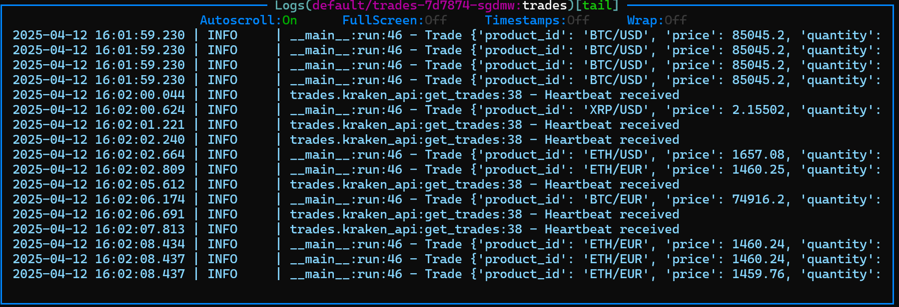

This is a project to predict crypto prices using Kafka, Kind, Kubernetes, uv, and Quix Streams.

## Initialize the Project

Initialize the project from the root directory. This will create the main `pyproject.toml` file.

```bash
uv init
```

Create a `trades` workspace in the `services` directory. This will create a `pyproject.toml` file in the `trades` workspace, with the `src` layout, and include the `hatchling` build-system. Additionally, it will add the `trades` workspace to the main `pyproject.toml` file.

```bash
cd services
uv init --lib trades
```

### Adding Workspaces

Each service is treated as a separate workspace. The `uv` tool uses the `[tool.uv.workspace]` section to define all workspace members.

To declare a workspace member in the main `pyproject.toml`:

```toml
[tool.uv.workspace]
members = ["services/trades"]
```

To add a workspace as a dependency, use:

```bash
uv add trades
```

This command does two things:

1. Adds trades to the dependencies list.

1. Adds an entry to the [tool.uv.sources] section in `pyproject.toml`, marking it as a workspace dependency:

   ```toml
   [tool.uv.sources]
   trades = { workspace = true }
   ```

### Adding Dependencies

To add dependencies to the main project, use the following command:

```bash
uv add quixstreams
```

To add local dependencies for development (`dependency-groups`) use the following command:

```bash
uv add --group tests pytest
```

### TA-Lib Installation

TA-Lib is a library for technical analysis of financial data. It is used in the project to calculate technical indicators.

You must install TA-Lib before adding it to the project. To install TA-Lib, follow the instructions on the following link:

https://ta-lib.org/install/#executable-installer-recommended

Then add the package to the project:

```bash
uv add ta-lib
```

### Synchronize the Project

To synchronize the project without installing the dependency groups, use the following command:

```bash
uv sync
```

To synchronize the project and install the dependency groups, use the following command:

```bash
uv sync --all-groups
```

## Setting up Kafka

To setup Kafka, we need first to create a Kind cluster with port mapping.

There are several scripts and folders in the `deployments/dev/kind` directory.

- `kind-with-portmapping.yaml`: This is the Kind configuration file. It includes the port mapping for Kafka.
- `manifests`: This folder contains the Kafka configuration files.
  - `kafka-e11b.yaml`: This is the Kafka configuration file. It includes the port mapping for Kafka. With this file there will be created the **2 Kafka pods** (`dual-role` and `entity-operator`).
  - `kafka-ui-all-in-one.yaml`: This is the Kafka UI configuration file. It includes the port mapping for Kafka UI. This will create the **Kafka UI pod**.
- `install_kafka.sh`: This script installs Kafka using [Strimzi](https://strimzi.io/quickstarts/) that allows to use Kafka in Kubernetes. It uses the `kafka-e11b.yaml` configuration file. With this file there will be created **8 core Kubernetes pods** (kube-system) and the `local-path-storage` pod from Kind to handle persistent storage in the cluster in addition to the pods created in `kafka-e11b.yaml`
- `install_kafka_ui.sh`: This script installs Kafka UI to make it easier to manage Kafka in a Web UI. It uses the `kafka-ui-all-in-one.yaml` configuration file.
- `create_cluster.sh`: This script runs all the previous scripts in order to create the Kind cluster with Kafka and Kafka UI.

Once you run the `create_cluster.sh` script (with docker running), you should see the following output in the `k9s` terminal:

```bash
chmod +x create_cluster.sh
./create_cluster.sh
```

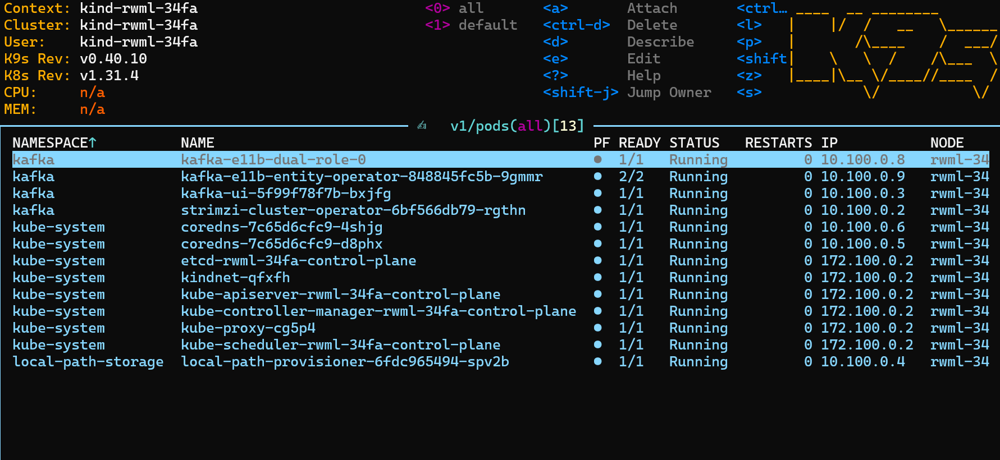

If we type `svc` in the `k9s` terminal, we should see the following output and the port mapping for Kafka and Kafka UI `8080`:


To visualize the Kafka UI, it is necessary to forward the port `8080` from the `kafka-ui` service (which communicates internally with the Kafka cluster on port `9092`) to port `8182` (or any other free port) on your local machine. This means that any traffic sent to `http://localhost:8182` on your local machine will be forwarded to the `kafka-ui` service running inside the Kubernetes cluster on port `8080`.

```bash
kubectl -n kafka port-forward svc/kafka-ui 8182:8080
```

> 💡**Note**: You can also use `tmux` to run the port-forwarding command in the background and keep it running. For that, you can use the following command:
>
> ```bash
> tmux new-session -d 'kubectl -n kafka port-forward svc/kafka-ui 8182:8080'
> ```
>
> To stop the port-forwarding, you can use the following commands. First check the session number with:
>
> ```bash
> tmux ls
> ```
>
> Then kill the session with:
>
> ```bash
> tmux kill-session -t <session_number>
> ```

Now you can access the Kafka UI in your local machine at `http://localhost:8182` or `http://127.0.0.1:8182`.

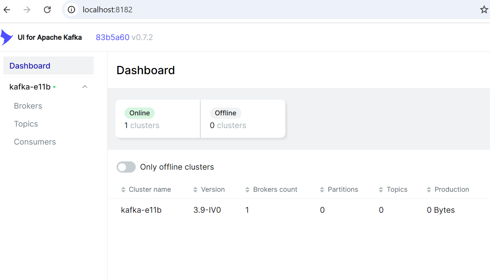

You can test the connection to the Kafka broker on TCP port `31234` with the following command:

```bash
nc -vvv localhost 31234
```

### Running a Service

Once you have the Kafka cluster running, you can run the services.

The first service is the `trades` service. This service will connect to the Kraken API and get the trades data in real time. It will then produce the trades data to the Kafka topic `trades`.

The following command will run the `trades` service, and you should see the trades data in the Kafka UI together with the terminal output:

```bash
uv run services/trades/src/trades/main.py
```

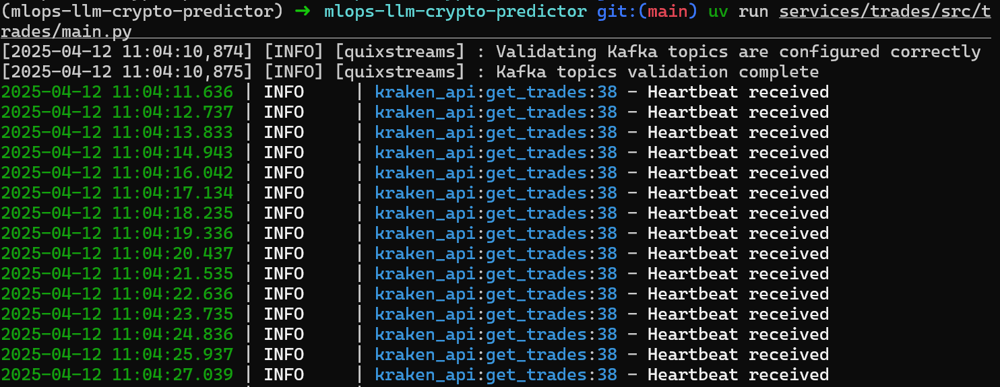

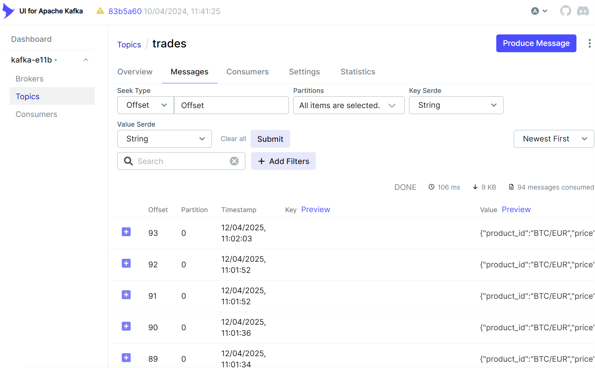

### Managing Partitions

By default the number of partitions is 1. If you change the number of partitions from the trades service from 1 to 2, you will see that the trades data is distributed between the two partitions. Only when both partitions have values, you can deploy the candles service with 2 replicas, so that each replica will consume from one partition.

Changing the partitions after the candles service is deployed will not work, because the candles service will not be able to consume from the new partitions and this will rise an error. You will need to delete the candles service and deploy it again with the new number of partitions.

## RisingWave

RisingWave is a streaming database that allows you to perform real-time analytics on streaming data. It is used in the project to store the candles data.

To setup RisingWave we need the `risingwave-values.yaml` file. This file contains the configuration for RisingWave.

To install RisingWave, run the following command:

```bash
chmod +x install_risingwave.sh
./install_risingwave.sh
```

To access the RisingWave UI, run the following command for port forwarding:

```bash
kubectl port-forward svc/risingwave -n risingwave 4567:4567
```

Then you can access the RisingWave UI in your local machine at:

```bash
psql -h localhost -p 4567 -d dev -U root
```

### Connecting RisingWave to Kafka

To [connect RisingWave to Kafka](https://docs.risingwave.com/ingestion/sources/kafka), you need to create a table. A table is a collection of data that is stored in RisingWave. To create a table, you need to specify the name of the table and the columns that the table will contain. The following is the syntax for creating a table. This can be found in the `query.sql` file.

```sql
CREATE SOURCE my_kafka_source (
    user_id INT,
    product_id VARCHAR,
    timestamp TIMESTAMP
) WITH (
    connector='kafka',
    topic='user_activity',
    properties.bootstrap.server='broker1:9092,broker2:9092'
) FORMAT PLAIN ENCODE JSON;
```

You can run the CREATE TABLE command of the `query.sql` file in the `psql` terminal to create the table.

To check the table, you can run the following command:

```sql
SELECT * FROM technical_indicators LIMIT 10;
```

To check the number of values in the table is being added, you can run the following command a few times:

```sql
SELECT COUNT(*) FROM technical_indicators;
```

To check the number of values in the table by pair, you can run the following command:

```sql
SELECT pair, COUNT(*) FROM technical_indicators GROUP BY pair;
```

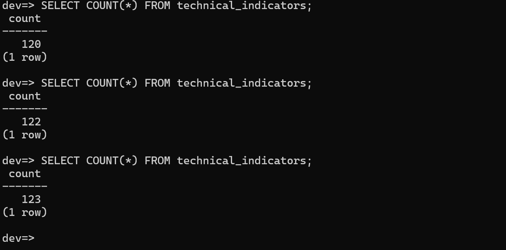

### Accessing the Minio UI

Minio is a tool for storing the runtime state of streaming jobs, such as:

- Operational state
- Snapshots and checkpoints
- Internal metadata

As per the `risingwave-values.yaml` file, there will be two buckets created: `risingwave` and `mlflow-d971`.

To access the Minio UI, run the following command for port forwarding:

```bash
kubectl port-forward -n risingwave svc/risingwave-minio 9001:9001
```

Then in the Minio UI, you can login with the following credentials as per the `risingwave-values.yaml` file:

```bash
rootUser: admin
rootPassword: "minio-D0408AC0"
```

Once the Minio UI is open, you can see the two buckets created: `risingwave` and `mlflow-d971`. You need to create access keys and add them in the manifest `mlflow-minio-secret.yaml`.

```yaml
apiVersion: v1
kind: Secret
metadata:
  name: mlflow-minio-secret
  namespace: mlflow
type: Opaque
stringData:
  AccessKeyID: VALUE_HERE
  SecretKey: VALUE_HERE
```

Then you can apply the secret with this command and visualize it in `k9s` terminal under secrets:

```bash
kubectl create namespace mlflow
kubectl apply -f deployments/dev/kind/manifests/mlflow-minio-secret.yaml
```

### Uninstalling RisingWave

To uninstall RisingWave, run the following command:

```bash
helm uninstall risingwave -n risingwave
```

## Grafana

Grafana is a tool for visualizing data. It is used in the project to visualize the candles data.

To setup Grafana we need the `grafana-values.yaml` file. This file contains the configuration for Grafana.

To install Grafana, run the following command:

```bash
chmod +x install_grafana.sh
./install_grafana.sh
```

To access the Grafana UI, run the following command for port forwarding:

```bash
kubectl port-forward -n monitoring svc/grafana 3000:80
```

Then in the Grafana UI, you can login with the following credentials as per the `grafana-values.yaml` file:

```bash
adminUser: admin
adminPassword: grafana
```

Inside the Grafana UI, you can add a data source like PostgreSQL, which is the database that RisingWave uses.

Add the following credentials:

Name: grafana-postgresql-datasource
Host URL: risingwave.risingwave.svc.cluster.local:4567
Database: dev
User: root
TLS/SSL Mode: disable

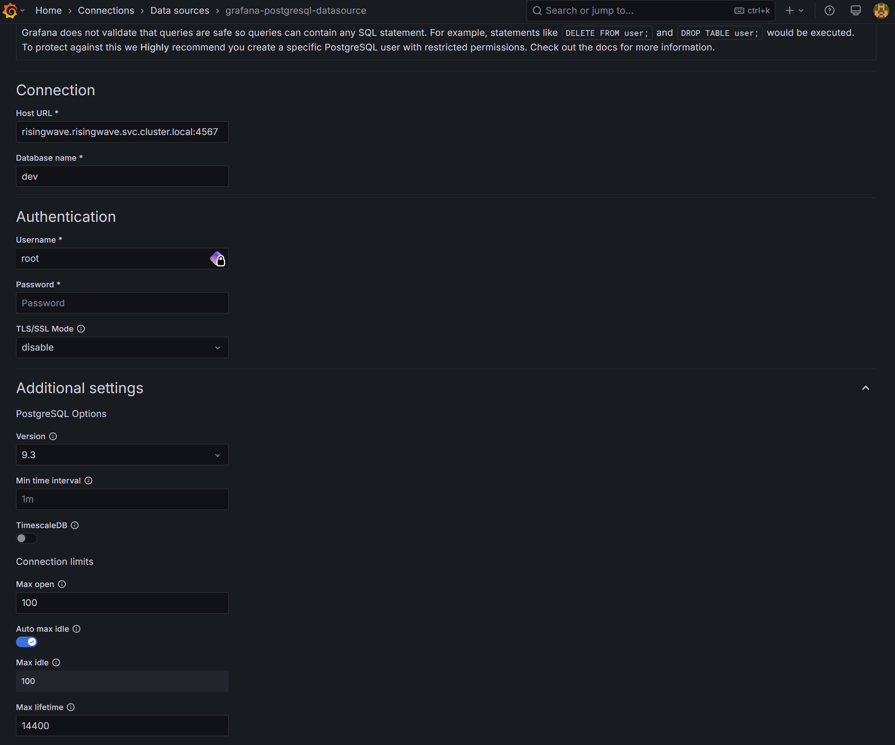

Then you can create a dashboard. You can search under dashboards for Candlestick. Then under code, you can copy the code query and paste it there.

```sql
SELECT open, high, low, close, pair, window_start_ms, window_end_ms, to_timestamp(window_end_ms/1000) as time FROM technical_indicators LIMIT 10;
```

```sql
SELECT open, high, low, close, pair, window_start_ms, window_end_ms, to_timestamp(window_end_ms/1000) as time FROM technical_indicators WHERE pair = 'ETH/EUR' ORDER BY window_end_ms DESC LIMIT 10;
```

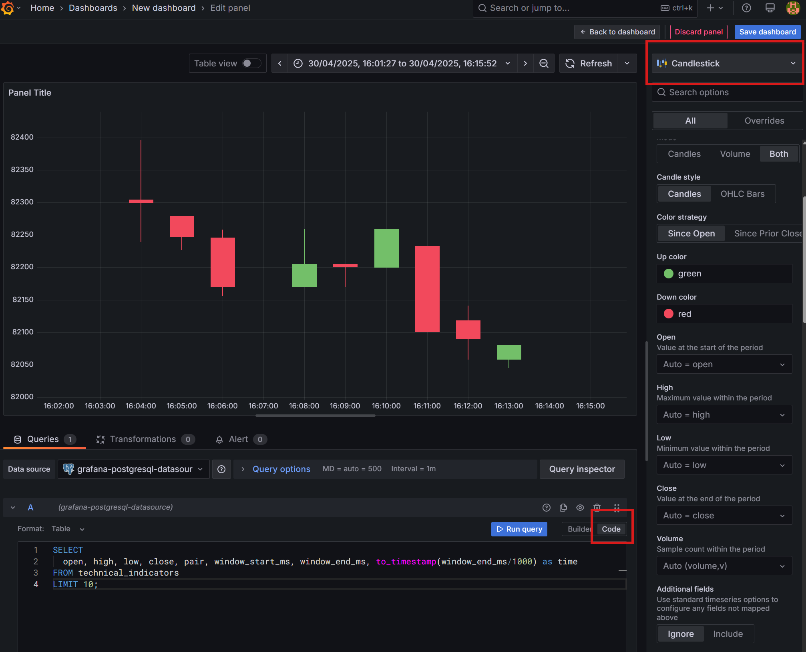

Then under dashboards -> settings you can take the JSON Model and save it in the `dashboards` folder. This can be imported in the future into Grafana again.

To uninstall Grafana, run the following command:

```bash
helm uninstall grafana -n monitoring
```

## MLflow

Once you have the Minio UI configured, you can install MLflow with the following commands. Make sure to have the `mlflow-values.yaml` file:

First, you need to create the database and user in RisingWave PostgreSQL. Enter the shell in the PostgreSQL pod:

```bash
kubectl exec -it -n risingwave risingwave-postgresql-0 -- bash
```

Then enter the PostgreSQL shell:

```bash
psql -U postgres -h risingwave-postgresql.risingwave.svc.cluster.local # password: postgres
```

Then create the database and user:

```sql
CREATE USER mlflow WITH ENCRYPTED password 'mlflow';
CREATE DATABASE mlflow WITH ENCODING='UTF8' OWNER=mlflow;
CREATE DATABASE mlflow_auth WITH ENCODING='UTF8' OWNER=mlflow;
```

You can see the database and user created:

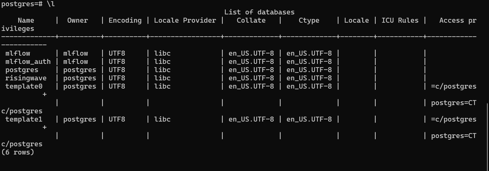

You can create the MLflow secret with the following command:

```bash
kubectl delete secret mlflow-tracking --namespace=mlflow
```

```bash
kubectl apply -f deployments/dev/kind/manifests/mlflow-tracking-secret.yaml
```

or

```bash
kubectl create secret generic mlflow-tracking \
  --from-literal=admin-user='your-user' \
  --from-literal=admin-password='your-password' \
  --namespace=mlflow
```

Then you can install MLflow:

```bash
helm upgrade --install --create-namespace --wait mlflow oci://registry-1.docker.io/bitnamicharts/mlflow --namespace=mlflow --values deployments/dev/kind/manifests/mlflow-values.yaml
```

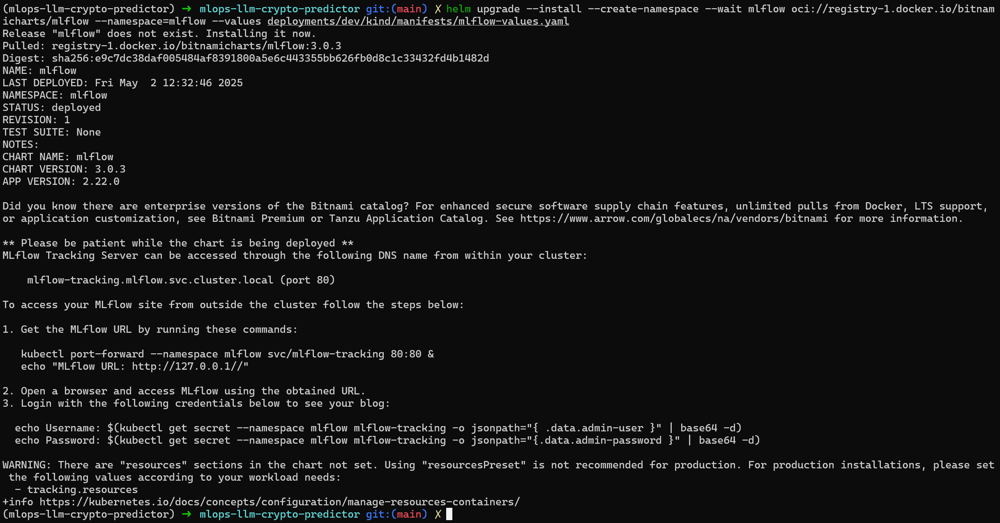

The temporary user and password are in the `mlflow-values.yaml` file. But you can get the password with the following command:

```bash
kubectl get secret --namespace mlflow mlflow-tracking -o jsonpath="{.data.admin-user }"  | base64 -d
```

```bash
kubectl get secrets -n mlflow mlflow-tracking -o json | jq -r '.data."admin-password"' | base64 -d
```

To uninstall MLflow, run the following command:

```bash
helm uninstall mlflow -n mlflow
```

## Makefile

The project includes a Makefile with several useful commands for development and deployment:

1. Kind Cluster Management

   ```bash
   make start-kind-cluster  # Start the Kind cluster with port mapping (or build it if it doesn't exist)
   make stop-kind-cluster   # Stop the Kind cluster
   ```

1. Development Commands

   ```bash
   make dev service=trades             # Run a specific service in development mode
   make build-for-dev service=trades   # Build a service's Docker image for development
   make push-for-dev service=trades    # Push a service's Docker image to the Kind cluster
   make deploy-for-dev service=trades  # Deploy a service to the Kind cluster
   ```

   To verify the deployment, use the following command or use `k9s` terminal:

   ```bash
   kubectl get deployments --all-namespaces
   ```

   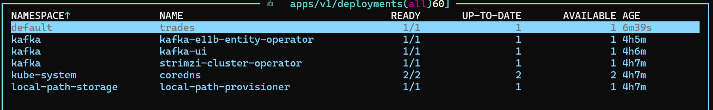

   

1. Linting and Formatting

   ```bash
   make ruff    # Run Ruff linter with auto-fix
   make mypy    # Run MyPy static type checker
   make clean   # Clean up cached files and build artifacts
   make all     # Run ruff, mypy, and clean in sequence
   ```

1. Help Command

   ```bash
   make help    # Display all available make commands with descriptions
   ```

## Pre-commit Hooks

The project uses pre-commit hooks to ensure code quality and consistency. To install the pre-commit hooks, run the following command:

```bash
pre-commit install
```

To update the pre-commit hooks to the latest versions, run the following command:

```bash
pre-commit autoupdate
```

To run the pre-commit hooks manually, run the following command:

```bash
pre-commit run --all-files
```

## Checking CPU and Memory

### Limits and Requests

```bash
kubectl get pods --all-namespaces -o custom-columns="NAMESPACE:.metadata.namespace,NAME:.metadata.name,CPU_REQUEST:.spec.containers[*].resources.requests.cpu,MEMORY_REQUEST:.spec.containers[*].resources.requests.memory,CPU_LIMIT:.spec.containers[*].resources.limits.cpu,MEMORY_LIMIT:.spec.containers[*].resources.limits.memory"
```

CPU (Requests/Limits):

- Total requested: ~2.2 vCPU
- Total limit: ~6–7 vCPU

Memory (Requests/Limits):

- Total requested: ~4.5–5Gi
- Total limit: ~10–11Gi

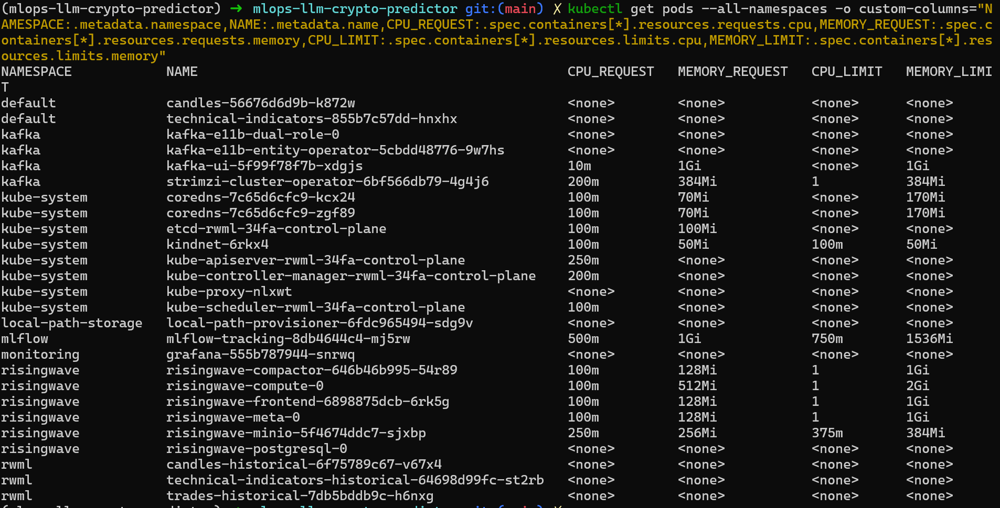

## Current Usage

Install Metrics Server:

```bash
kubectl apply -f https://github.com/kubernetes-sigs/metrics-server/releases/download/v0.7.2/components.yaml
```

Modify the Metrics Server deployment:

```bash
kubectl get deployment metrics-server -n kube-system -o yaml > metrics-server-deployment.yaml
```

Open in code editor and add the following line `--kubelet-insecure-tls` under `args`:

```yaml
    spec:
      containers:
      - args:
        - --cert-dir=/tmp
        - --secure-port=10250
        - --kubelet-preferred-address-types=InternalIP,ExternalIP,Hostname
        - --kubelet-use-node-status-port
        - --metric-resolution=15s
        - --kubelet-insecure-tls
```

Apply the modified deployment:

```bash
kubectl apply -f metrics-server-deployment.yaml
```

Check CPU and memory usage:

```bash
kubectl top nodes
kubectl top pods --all-namespaces
```

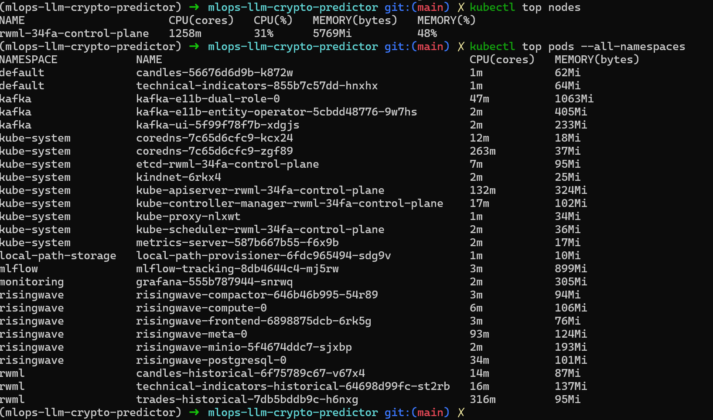

### Recommended Civo Cluster Size

Choose at least 1 node with this configuration:

- 3-4 vCPU
- 7–8 GiB RAM

Or take two nodes for redundancy.

- CPU per node: 2 vCPU
- Memory per node: 4 GiB RAM

Get Civo instance sizes (get your API key from Civo [here](https://www.civo.com/api/instances))

```bash
curl -s -H "Authorization: bearer <your-api-key>" https://api.civo.com/v2/sizes | jq -r '[.[] | select(.selectable == true)] | ["Name","Type","CPU","RAM (MiB)","Disk (GB)"], (.[] | [.name, .type, (.cpu_cores|tostring), (.ram_mb|tostring), (.disk_gb|tostring)]) | @tsv' | column -t
```

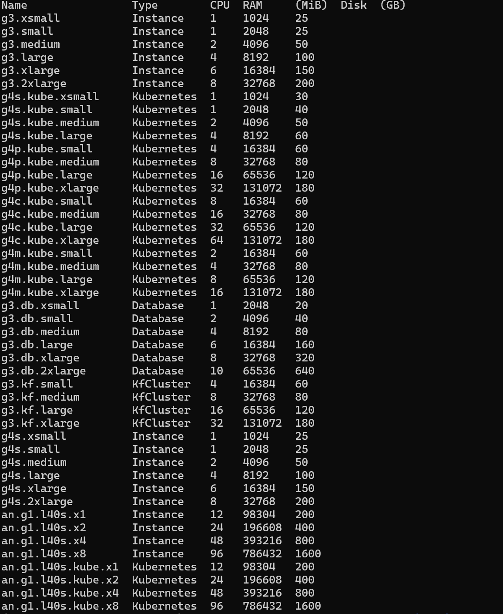

Example Civo plan:

- One node: `g4s.kube.large` (4 vCPU / 8GiB RAM).
  - Cost: 0.06 USD/h, 21.75 USD/month
- Two nodes: `g4s.kube.medium` (2 vCPU / 4GiB RAM)
  - Cost: 0.03 USD/h, 43.50 USD/month

## Kafka UI (Prod)

The Kafka UI is available at the following URL:
